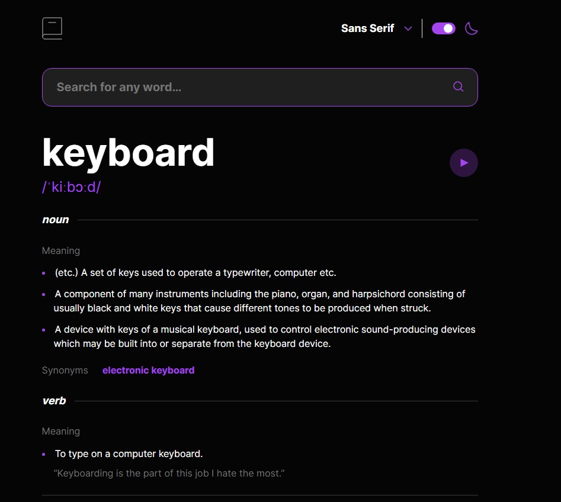
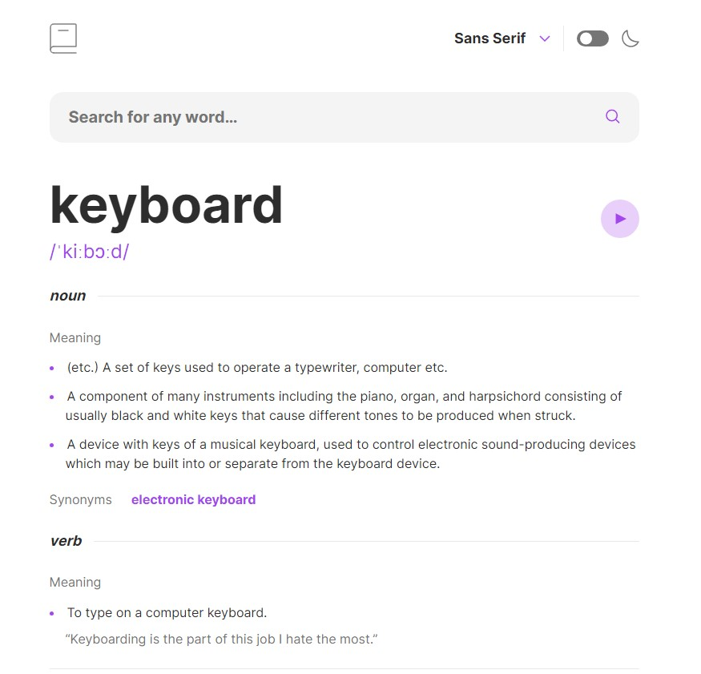

# Frontend Mentor - Dictionary web app solution

## Welcome every@ne!

### I am Vincenzo 👋

This is my solution to the [Dictionary web app challenge on Frontend Mentor](https://www.frontendmentor.io/challenges/dictionary-web-app-h5wwnyuKFL).

## Table of contents

- [Overview](#overview)
  - [The challenge](#the-challenge)
  - [Screenshot](#screenshot)
  - [Links](#links)
- [My process](#my-process)
  - [Built with](#built-with)
  - [What I learned](#what-i-learned)
  - [Continued development](#continued-development)
  - [Useful resources](#useful-resources)
- [Author](#author)
- [Acknowledgments](#acknowledgments)

## Overview

### The challenge

Users should be able to:

- Search for words using the input field
- See the Free Dictionary API's response for the searched word
- See a form validation message when trying to submit a blank form
- Play the audio file for a word when it's available
- Switch between serif, sans serif, and monospace fonts
- Switch between light and dark themes
- View the optimal layout for the interface depending on their device's screen size
- See hover and focus states for all interactive elements on the page

### Screenshots




### Links

- [GitHub Code](https://github.com/ViuCoding/viu-dictionary)
- [Live Site URL](https://viu-dictionary.netlify.app/)

## My process

### Built with

- [React](https://reactjs.org/) - JS library
- TypeScript
- [Styled Components](https://styled-components.com/) - For styles
- React Query
- Axios
- Semantic HTML5 markup
- Mobile-first workflow
- Flexbox

### What I learned

- I learned to deal with "not so well formatted" JSON response objects.
- I implemented dark/light themes using Styled Components

```js
const lightTheme = {
  bodyBg: colors.white,
  mainText: colors.darks.dark3,
  dropDown: colors.white,
  inputBox: colors.greys.grey3,
  dividerLine: colors.greys.grey2,
  boxShadow: `0px 5px 30px 0px rgba(0, 0, 0, 0.10)`,
}
const darkTheme = {
  bodyBg: colors.darks.dark1,
  mainText: colors.white,
  dropDown: colors.darks.dark2,
  inputBox: colors.darks.dark2,
  dividerLine: colors.darks.dark4,
  boxShadow: `0px 5px 30px 0px #A445ED`,
}

<ThemeProvider theme={colorTheme === 'light' ? lightTheme : darkTheme}>
  const handleToggleChange = (e: ChangeEvent<HTMLInputElement>) => {
    setChecked(e.target.checked)
    setColorTheme((prevTheme) => (prevTheme === 'light' ? 'dark' : 'light'))
  }
```

- How to play audio files on button click

```js
let audioMP3 = new Audio(audio)

const playAudio = () => {
  audioMP3.play()
}
```

- Sharing State Between Components and "Lifting state up" to the parent component, passing event handlers as props from parent to child

## Author

- Website - [My Portfolio Page](https://vincenzocristiano.dev/)
- GitHub Profile - [@ViuCoding](https://github.com/ViuCoding)
- LinkedIN Profile - [@Vincenzo Cristiano](https://www.linkedin.com/in/vincenzo-cristiano/)

## Acknowledgments

Thanks a lot to Frontend Mentor for this amazing challenge and to my friends/family for giving me the feed back i needed to improve the WebApp!!
Onto the next one!
